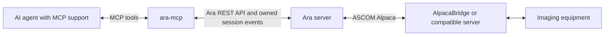
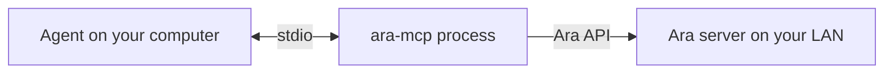
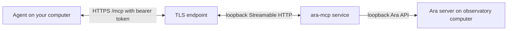

# ara-mcp

[](go.mod)
[](LICENSE)
[](https://github.com/cavenine/ara-mcp/actions/workflows/ci.yml)

**Give an MCP-compatible AI agent a clear, controlled way to work with
[OpenAstro Ara](https://github.com/open-astro/openastro-ara).** ara-mcp translates
MCP tool calls into Ara API requests; Ara remains responsible for the rig, saved
sequences, and execution.

## What it does

Use an AI agent to inspect the rig and sequences, prepare and validate a plan, request
supported equipment actions, and monitor Ara jobs and runs. ara-mcp is an adapter,
not a replacement for Ara, a hardware driver, or an imaging sequencer.



## Choose how to run it

| Setup | Best for | Connection |
| --- | --- | --- |
| **Local process (stdio)** | Agent and ara-mcp run on your computer; Ara is reachable over the network. | The agent starts ara-mcp and exchanges MCP messages over stdin/stdout. |
| **Service beside Ara (Streamable HTTP)** | ara-mcp runs persistently on the observatory computer; one or more remote agents connect to it. | The agent connects to `https://<host>/mcp` through a TLS-enabled endpoint. |

Both modes use the same tools. Select one transport per ara-mcp process. HTTP clients
share the adapter's one Ara control identity.

### Local process: stdio



1. Build ara-mcp as described in [Install](#install).
2. Add a server entry to your MCP client's configuration. This common `mcpServers`
   shape is illustrative; use your client's documented file location and adapt field
   names if needed. No named third-party MCP host compatibility is claimed.

```json
{
  "mcpServers": {
    "ara-mcp": {
      "command": "/absolute/path/to/ara-mcp",
      "args": [
        "--ara-url", "http://192.168.1.50:5555",
        "serve"
      ]
    }
  }
}
```

Replace the command path and Ara address. If Ara runs on the same computer, use
`http://127.0.0.1:5555`. Stdio does not need an ara-mcp HTTP bearer token.

### Service beside Ara: Streamable HTTP



Install the service using the [persistent deployment guide](docs/deployment.md). Keep
the MCP listener on loopback behind a trusted TLS reverse proxy, or configure ara-mcp
itself for TLS. Then configure the MCP client with its HTTPS endpoint and token. This
common remote-server shape is illustrative; follow the client documentation for its
exact schema and secure secret storage.

```json
{
  "mcpServers": {
    "ara-mcp": {
      "type": "http",
      "url": "https://observatory.example.net/mcp",
      "headers": {
        "Authorization": "Bearer <your-32-or-more-character-token>"
      }
    }
  }
}
```

Configure the matching `ARA_MCP_HTTP_BEARER_TOKEN` on the service. Use a unique random
token, restrict access to the client configuration that stores it, and never put it in
the URL. Non-loopback HTTP listeners require TLS. Diagnostics use a separate optional
listener and separate credentials.

## Install

There are no published release binaries yet. Build from source with Go 1.27.x (the
module selects Go 1.27.1):

```sh
git clone https://github.com/cavenine/ara-mcp.git
cd ara-mcp
mkdir -p bin
go build -trimpath -ldflags='-s -w' -o ./bin/ara-mcp ./cmd/ara-mcp
./bin/ara-mcp version
```

Use that local binary path in the stdio configuration above. For a Linux ARM64
observatory computer, build on the target or cross-build and copy the executable:

```sh
CGO_ENABLED=0 GOOS=linux GOARCH=arm64 go build -trimpath -ldflags='-s -w' \
  -o ara-mcp ./cmd/ara-mcp
```

The ARM64 executable was exercised on a Raspberry Pi 4 with Debian 13 and simulated
equipment. Other CI cross-build targets are not hardware-validation claims. There is
no released version to download yet; the planned first adapter version is `v0.1.0`
and is not published.

## Connect and use it

Before connecting, configure and connect the profile and devices in Ara. Set the Ara
API base URL with `--ara-url` (or `ARA_MCP_ARA_URL`); the default is
`http://127.0.0.1:5555`.

1. Start or reconnect the MCP client and call `get_server_context` and
   `get_rig_context`. Check the active profile and device availability.
2. Use read tools to inspect saved sequences and templates. For changes or equipment
   actions, call `begin_control` and use the returned `control_id` as required by the
   tool.
3. Review and validate a saved plan before separately requesting `start_sequence`.
   Monitor Ara's authoritative state; an accepted command is not proof of completion.
4. Call `end_control` when finished. Ending control or disconnecting the agent does not stop an Ara run.

Control is cooperative: while the adapter controls the rig, do not send mutating
commands through Ara's UI or another controller. Ara remains the final execution
authority. Follow the [sequence-authoring and execution recipe](docs/sequence-authoring.md)
and read its compatibility limits before running a plan.

## Current validation and limits

- Both stdio and authenticated Streamable HTTP passed live workflows against the
  pinned Ara development build and OmniSim on a Raspberry Pi 4 (Debian 13, ARM64).
  This is simulator evidence, not a physical-rig result.
- The live flows covered sequence and representative camera operations. The wider T07
  manual-tool set has fake-Ara/MCP contract coverage, not live-daemon or physical-device
  validation.
- HTTP TLS/browser access and initial process-resource measurements were checked on
  that setup. At-limit dashboard/export CPU exceeded the provisional 5% busy target;
  see the recorded [T10 evidence](docs/plan.md#t10-deployment-and-end-to-end-validation).
- No Pi 3 suitability, minimum-memory recommendation, physical-imaging result,
  trusted-certificate/reverse-proxy validation, or named third-party MCP host
  compatibility is claimed.
- Ara's first Ara-specific release tag and additional operation/sequence evidence
  remain open. The exact compatibility gates are listed in
  [API contract notes](docs/api-contracts.md#remaining-release-and-implementation-gates).
- No ara-mcp release has been published. The initial candidate is `v0.1.0`; release
  artifacts must be built from the selected source commit and published only after
  review.

## Documentation

- [Tool reference](docs/tools.md): available tools and important behavior boundaries.
- [Sequence recipe](docs/sequence-authoring.md): prepare, validate, save, start, and
  monitor a plan.
- [Persistent HTTP deployment](docs/deployment.md): service installation, TLS/access, updates, and rollback.
- [Resource dashboard](docs/resource-dashboard.md): process charts, exports, and recent events from the owned Ara session.
- [Configuration and development guide](docs/development.md): settings, commands, testing, and integration checks.
- [Release and source distribution](docs/release.md): platform archives, checksums,
  license notices, and source-build procedure.
- [Architecture](docs/architecture.md): adapter responsibilities, Ara API notes, and resource constraints.
- [Implementation plan](docs/plan.md): task status and validation evidence.

## License and source

ara-mcp is licensed under [AGPL-3.0-or-later](LICENSE). The exact Go module versions
are recorded in [`go.mod`](go.mod) and [`go.sum`](go.sum); third-party license/source
links are in [`THIRD_PARTY_NOTICES.md`](THIRD_PARTY_NOTICES.md). Source for each build
is identified by its commit and available from [the repository](https://github.com/cavenine/ara-mcp).
Network operators can provide users the corresponding source by linking the exact
source commit used to build the service.

## Contributing

See [CONTRIBUTING.md](CONTRIBUTING.md) for development checks and pull requests. ara-mcp is an independent project under the cavenine organization, not an official OpenAstro component.
