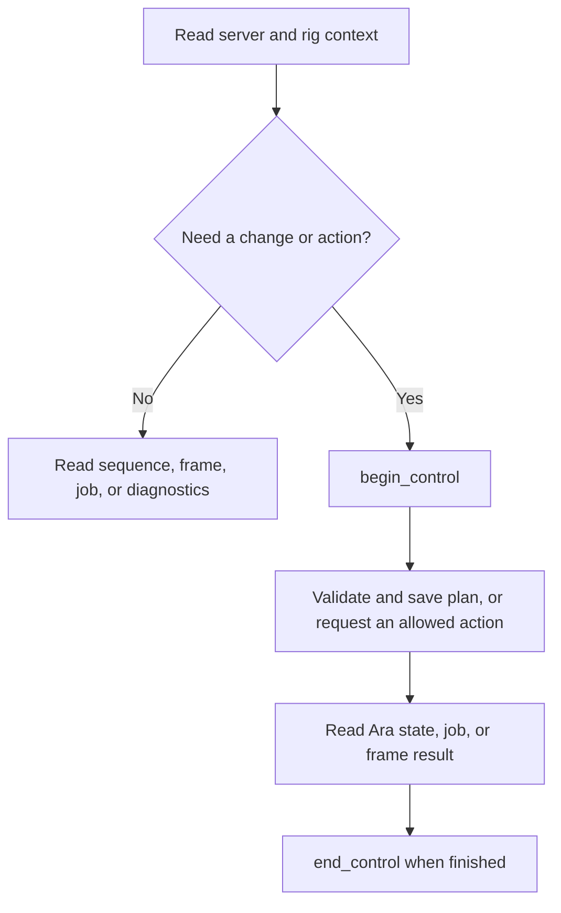

# Tool reference

ara-mcp exposes the same MCP tools over stdio and Streamable HTTP. Ara remains the
source of truth for rig state, saved plans, operations, and sequence execution.
This reference describes the current implementation; live and hardware evidence is
bounded by the [compatibility notes](api-contracts.md#remaining-release-and-implementation-gates).

## Typical workflow

The diagram is a usage guide, not an automatic sequence: authoring/saving and
starting are separate calls, and `begin_control` is required for mutations.

## Read and inspect

| Tool | Purpose |
| --- | --- |
| `get_server_context` | Ara identity, API versions, and server state. |
| `get_rig_context` | Active profile, site/imaging defaults, filters, and device status/capabilities. |
| `list_sequences`, `get_sequence` | List saved plans and read one plan. |
| `list_sequence_templates` | Read available templates and their bodies. |
| `validate_sequence` | Return Ara structural validation and the adapter's supported-palette result. This is not rig readiness or equipment preflight. |
| `get_sequence_state` | Read current Ara run state. A missing in-memory state does not prove completion. |
| `get_job_status` | Read an Ara background job. Job state is ephemeral and can disappear after Ara restarts. |
| `get_autofocus_state` | Read the current/recent autofocus run, including probes, fit, terminal result, and current frame sequence. |
| `get_autofocus_frame` | Return Ara's latest autofocus probe/confirmation JPEG as MCP image content, capped at 1 MiB; metadata includes Ara's `X-Frame-Seq`. |
| `get_autofocus_calibration` | Read stored Smart Focus calibration, or `calibrated: false` when Ara has none. |
| `list_faults`, `get_fault` | Browse retained fault history with bounded cursor pages/filters and read one fault. History may be pruned and is not a complete event journal. |
| `get_guide_focus_status`, `get_guide_focus_frame` | Read Ara's guide-camera focus lease status and the latest bounded JPEG frame when available. |
| `solve_frame` | Plate-solve a saved Ara frame; returns coordinates and solution metadata without exposing FITS data or server paths. |
| `list_frames`, `get_frame` | Browse saved frames and read frame metadata. |
| `get_frame_preview` | Return a bounded JPEG preview (maximum 1 MiB); Ara can return a placeholder if the FITS file is unavailable. |
| `get_recent_ara_events` | Read bounded events from the adapter-owned session socket, including exposure timing, guider measurements/session markers, autofocus probe/fit/results, equipment identity, state, progress, and fault/action context where Ara supplies it. Without control, no new events arrive; replay/overflow gaps are explicit. Reconcile with state tools. |
| `get_adapter_diagnostics` | Read Ara reachability and a local process/runtime sample. |

## Control, authoring, and execution

| Tool | Purpose |
| --- | --- |
| `begin_control` | Require an active Ara profile, claim the shared Ara session, and return a local `control_id`. |
| `end_control` | Release that session and invalidate its ID. It does not stop Ara work. |
| `create_sequence`, `update_sequence` | Save or edit a plan through Ara. Supply the required `control_id` and a new `intent_id`. |
| `instantiate_sequence_template` | Ask Ara to instantiate a template and save the resulting plan. |
| `start_sequence` | Re-read and preflight a saved plan, then request Ara to start it. |
| `pause_sequence`, `resume_sequence`, `stop_sequence`, `abort_sequence` | Request lifecycle actions against the expected current Ara run ID. |

The adapter accepts only its bounded supported sequence palette. Start checks Ara
validation, connected required devices, camera-reported exposure/gain/offset/binning
limits, and filter-wheel slots where used. These checks do not replace Ara's execution
guards. Read the full [sequence recipe](sequence-authoring.md) before authoring or
starting a plan.

Mutations use `control_id` and an `intent_id` to arbitrate/reconcile requests. Do not
automatically retry an uncertain equipment action. An accepted response is not
completion; read the relevant Ara sequence, job, frame, or device state. Run-control
tools require `expected_run_id`. Stop and abort use reserved interrupt capacity.

## Manual equipment actions

These tools are implemented and covered by fake-Ara/MCP contract tests. The full T07
set has not been exercised against a live daemon or physical equipment; only the
representative operations listed in T10 have simulator evidence.

| Tool | Equipment/action |
| --- | --- |
| `capture_exposure`, `abort_exposure`, `set_camera_cooler` | Camera exposure, exposure abort, and cooler setting. Exposures use seconds. |
| `slew_telescope`, `park_telescope`, `unpark_telescope`, `abort_telescope_slew` | Telescope motion and park actions. Coordinates use the units in the tool schema. |
| `move_focuser`, `run_autofocus`, `cancel_autofocus`, `recalibrate_autofocus` | Focuser movement; start/observe/cancel Ara autofocus; clear its stored calibration for the next successful Classic sweep. Cancellation can target a sequence-started run. Recalibration is refused during an active sequence or autofocus run. |
| `select_filter` | Select an available Ara-reported filter-wheel slot. |
| `start_guiding`, `stop_guiding`, `dither_guiding` | PHD2 guider actions; dither amplitude is in pixels. |
| `start_guide_focus`, `stop_guide_focus` | Start/stop Ara's guide-camera focus loop through its lease; status/frame reads are separate. |
| `center_on_coordinates`, `cancel_centering_job` | Start Ara's asynchronous coordinate-centering job or request cancellation of a queued/running centering job. The cancel tool returns an immediate Ara job-state observation; neither acceptance nor job cancellation proves the mount is stationary. |
| `emergency_stop` | Request Ara's synchronous best-effort emergency-stop ladder. |

Autofocus cancel/recalibration and guide-camera focus start/stop require the current
control ID and a new intent ID. Recalibration is refused during an active sequence or
autofocus run. Centering returns an Ara job ID; use `get_job_status` to observe its
outcome. Mutations remain accepted requests until Ara state/job evidence confirms an
outcome.

Normal manual actions require active control, connected-device/capability checks,
and no active or paused sequence. Mount abort, exposure abort, and emergency stop
use the interrupt lane. Tool acceptance is not proof that hardware completed an
operation; use the returned frame/job identifier or read device state where available.

## Process dashboard (not an MCP tool)

When the optional diagnostics listener is enabled, it exposes local process health,
Prometheus metrics, and the self-updating resource dashboard at `/`. CSV/JSONL
exports and the optional bounded archive are described in the
[dashboard guide](resource-dashboard.md). Diagnostics access is separate from MCP
access; remote access requires separate credentials and TLS. Native pprof is
disabled by default and requires Basic authentication even on loopback.
